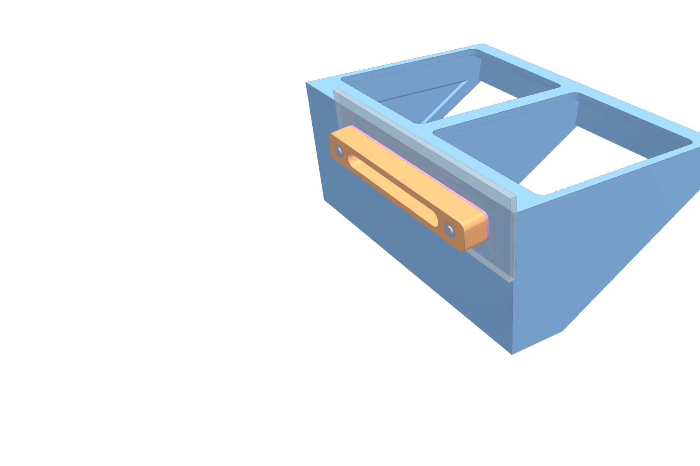

# JOBO / THD CP-Lift parts

3D-printable parts for working with JOBO drums on the THD CP-Lift. Each part is a parametric FreeCAD model with STEP files and printing notes.

▶ **Videos:** [YouTube playlist](https://www.youtube.com/playlist?list=PLADhkNYpSGAc)

| Part | What it does | Folder |
|---|---|---|
| **Bottle holder** | An optimised redesign for this machine: holds four standard JOBO bottles in the water bath. It mounts with stainless countersunk screws through the 3 mm bath wall into a printed nut bar. Strength-checked by FEM; see the [design report](bottle-holder/docs/report.md). | [`bottle-holder/`](bottle-holder/) |
| **Drum mount** | Holds a JOBO drum on the lift, with a sliding lock and a printed spring. | [`drum-mount/`](drum-mount/) |

| Bottle holder, assembled | Exploded |
|---|---|
|  |  |

## Common notes

- **Material:** PETG for everything that goes near the water bath.
- **Profile used for the times in each README:** 0.4 mm nozzle, 0.6 mm line width, 0.2 mm layers, 5 walls, OrcaSlicer on a Bambu Lab A1.
- **Models:** made with a FreeCAD 26.3 development build. Older FreeCAD releases may not open them; the STEP files work in any CAD or slicer.
- **Changing sizes:** every model is driven by a spreadsheet (`params` or `Params`). Change the values there and recompute.

## License

[CC BY-NC-SA 4.0](LICENSE). You may share and adapt these designs with attribution, not for commercial use, and under the same license.
