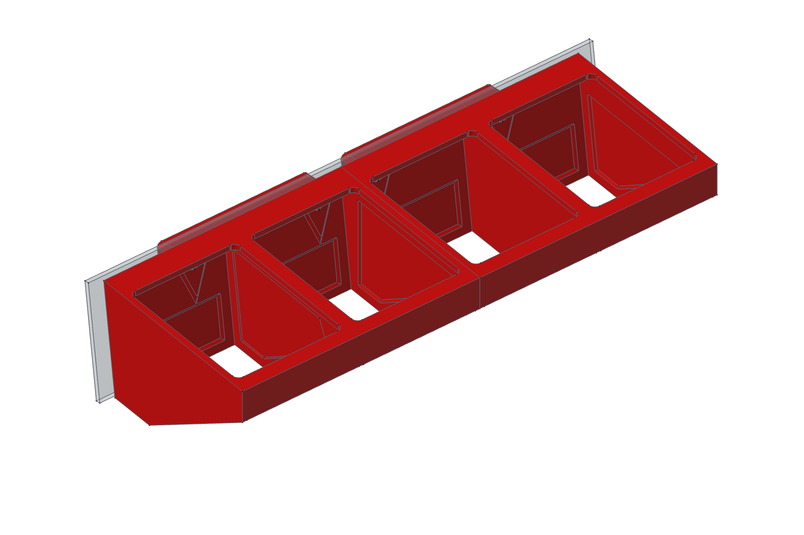
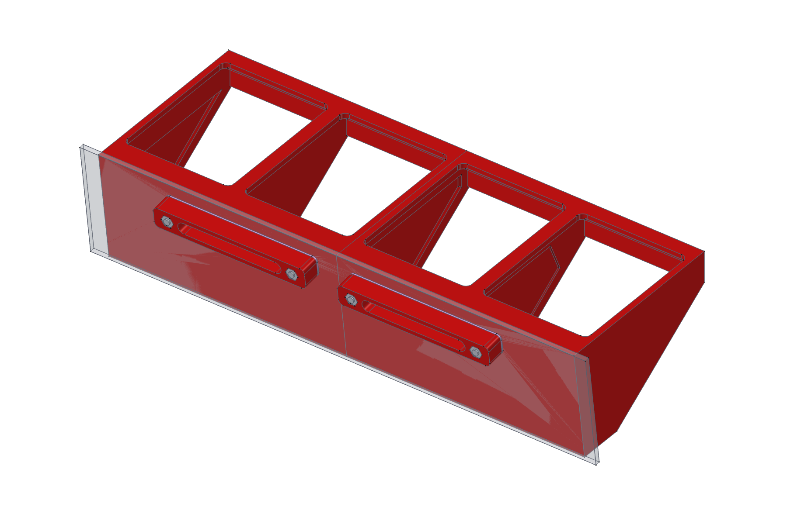
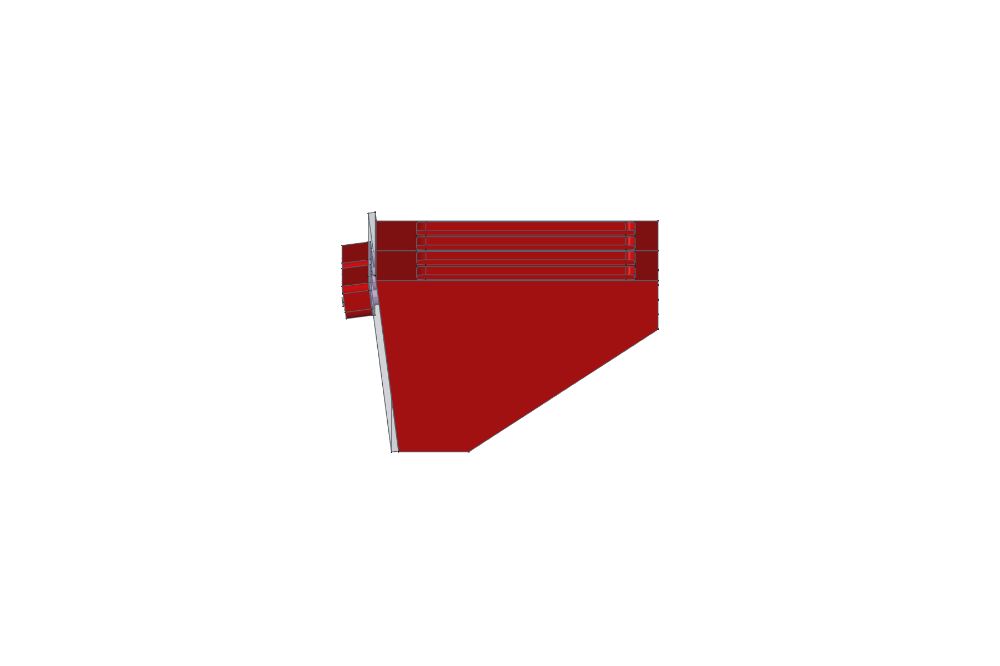
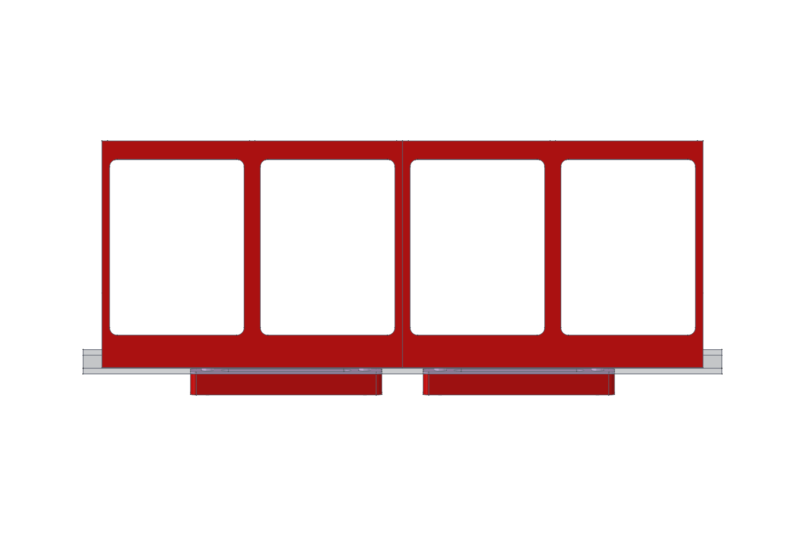
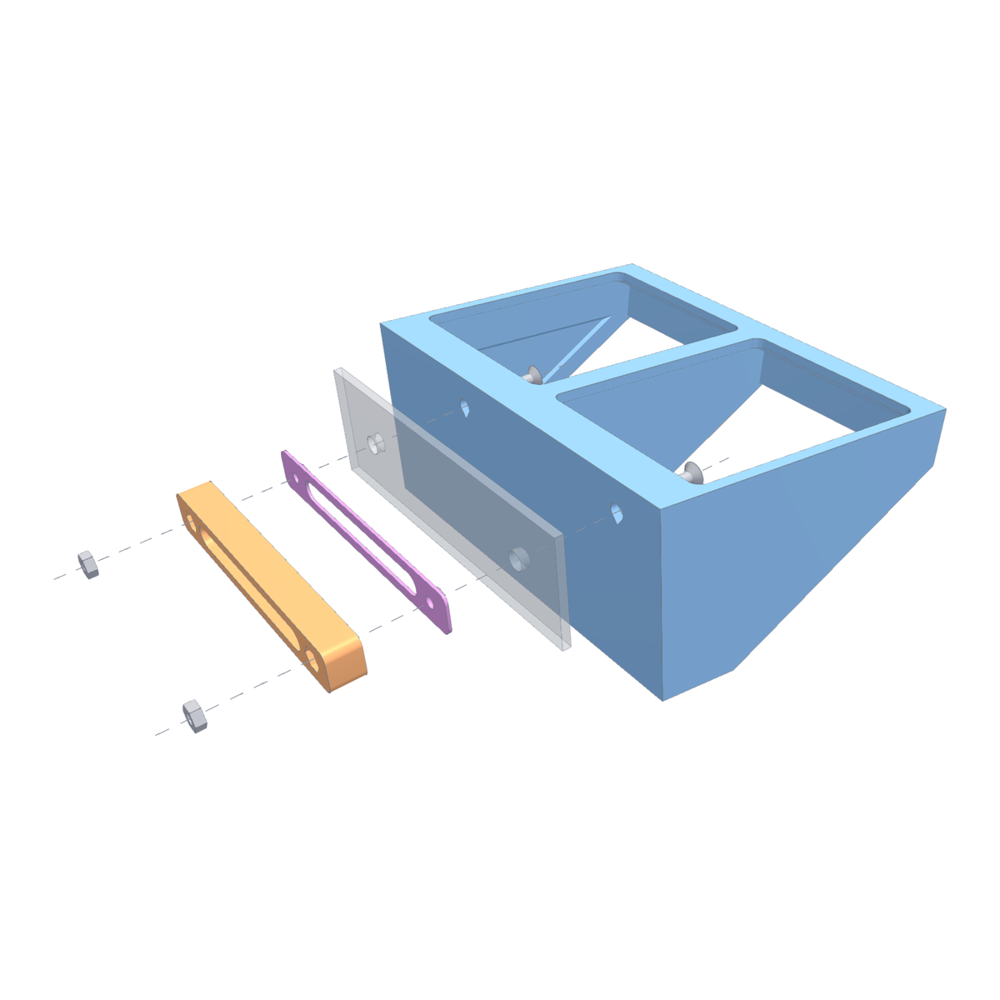
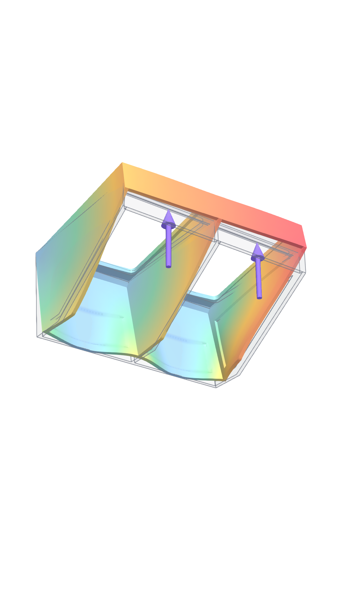
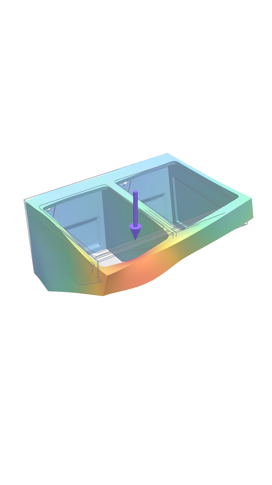
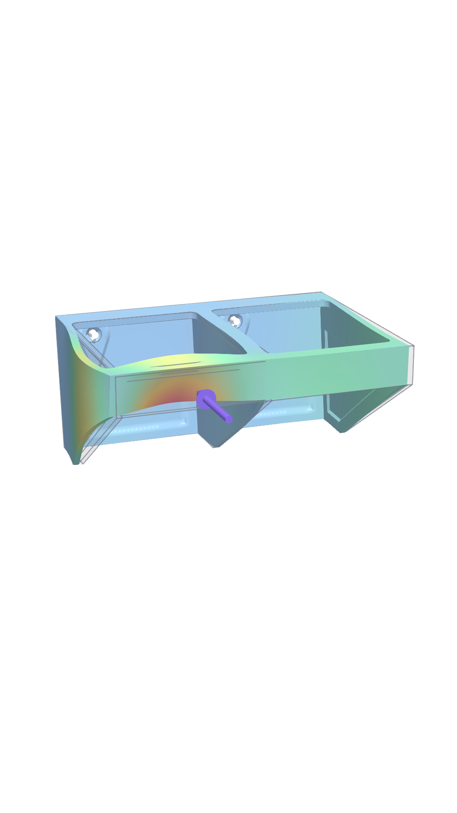
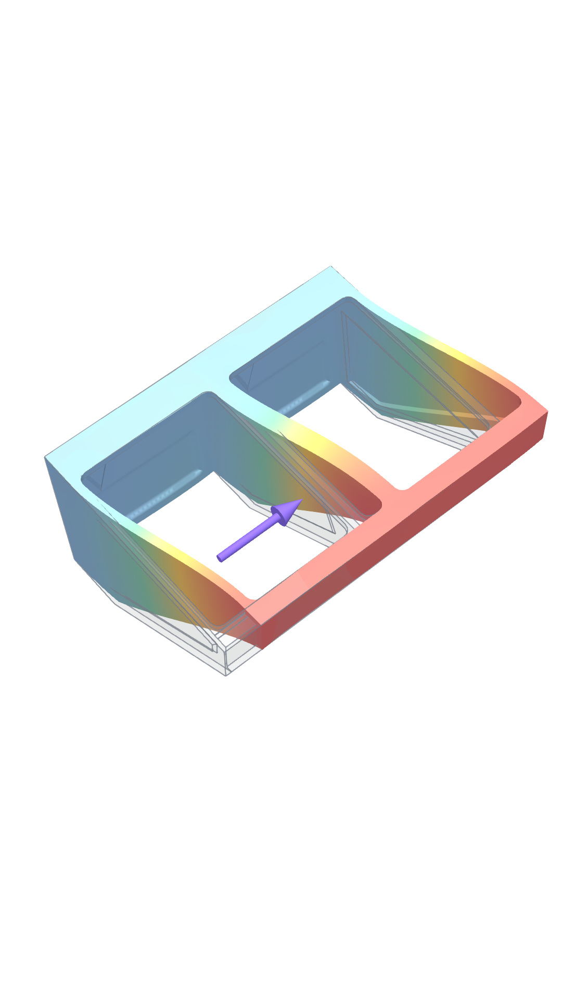

# THD CP-Lift bottle holder

**Release:** [v1.0](https://github.com/sasha-nordiclab/jobo-thd-cp-lift-parts/releases/tag/bottle-holder-v1.0). Download the STEP files and the FreeCAD model as one zip.

An optimised redesign of the bottle holder, reworked for the THD CP-Lift. It holds **four standard JOBO bottles** in the water bath.

- It mounts with stainless steel countersunk screws through the 3 mm bath wall. A printed nut bar on the outside of the bath holds the nuts.
- Each module holds two bottles. Print one **Module**, one **Module mirrored**, two **Nut bars** (PETG) and two **Gaskets** (TPU).

▶ **Videos:** [YouTube playlist](https://www.youtube.com/playlist?list=PLADhkNYpSGAc)

<table align="center">
  <tr><td align="center"> <b>Bottle side</b></td><td align="center"> <b>Bath side</b></td></tr>
  <tr><td align="center"> <b>Side</b></td><td align="center"> <b>Top</b></td></tr>
</table>

| | Per module |
|---|---|
| Size | 120.4 × 159.5 × 73.5 mm |
| Bottle opening | 93.4 × 71.4 mm, corner radius 4 mm (×2) |
| Mounting | 2 × M4 × 20 countersunk Torx screws (304 stainless) + 2 nuts in a nut bar |
| Material | PETG |
| Mass / print time | ≈ 126 g / ≈ 3 h (solid, see [Printing](#printing)) |

## Files

| Path | What |
|---|---|
| `cad/THD_CP_Lift_Bottle_Holder.FCStd` | Parametric FreeCAD model: bodies `Module` and `Nut bar`, plus their mirrors |
| `step/THD_CP_Lift_Holder_Module.step` | Module, for slicing or other CAD |
| `step/THD_CP_Lift_Holder_Module_Mirrored.step` | Mirrored module |
| `step/THD_CP_Lift_Nut_Bar.step` | Nut bar; print two, the same part fits both modules |
| `step/THD_CP_Lift_Gasket_TPU.step` | Gasket under the nut bar; print two in TPU 95A |
| `docs/report.md` | Design report: how it works, assembly, calculations, FEM pictures |
| `docs/strength.md` | How the part was checked and why it looks the way it does |
| `scripts/fem/` | The strength calculation (CalculiX), for the default size |

## Printing

- **Orientation:** frame face down on the bed. The top face is flat, and nothing is steeper than 40° except the small screw countersinks. No supports are needed.
- **Profile:** PETG, 0.4 mm nozzle, 0.6 mm line width, 0.2 mm layers, 5 walls.
- **Infill:** **100 %, rectilinear (zig-zag).**
  - The walls are 1.8–3 mm thick and the strength check assumes solid plastic.
  - 5 walls of 0.6 mm fill the 3 mm walls exactly, and 100 % infill makes the 3.6 mm frame solid.
  - On thin-walled parts like this, 100 % rectilinear was faster than 40 % cubic.
- **Result:** in OrcaSlicer on a Bambu Lab A1, about 3 h 05 min and 126 g per module.

## Mounting

<a href="docs/img/exploded.mp4">▶ Explode animation</a>

**Per module you need:**
- 2 × **M4 × 20 countersunk Torx screws**, 304 stainless (ISO 14581, 90° head Ø 8.4 mm). They fit the Ø 9.2 mm countersink.
- 2 × **M4 nuts** ISO 4032, stainless.
- 1 × **printed nut bar**.
- 1 × **TPU gasket** (between the bath and the nut bar).

The screws go in from the bottle side, through the holder and the bath's Ø 6.6 mm holes. The nuts sit in the hex pockets of the nut bar on the outside of the bath.

**The stack along the screw:**

| Part of the stack | mm |
|---|---|
| Head top to the holder's mounting face | 4.0 |
| Bath wall | 3.0 |
| TPU gasket | 1.0 |
| Nut bar under the nut | 7.9 |
| Nut ISO 4032, flush in its pocket | 3.2 + 0.2 |
| Screw tip past the nut | 0.9 |
| **Total** | **20** |

The nut bar is sized to the screw. `bolt_len` in the spreadsheet sets the screw length, and the bar thickness follows (11.3 mm for M4 × 20 with the 1 mm gasket, at least 5.4 mm). The tip then ends just past the nut and does not stick out behind the bath; `bolt_tip` shows the overhang.

- **Sealing the bath holes.** A flat 1 mm TPU 95A gasket with the same outline as the nut bar goes between the bar and the outside of the bath wall. Tightening squeezes it.
  - A Ø 6.3 mm sleeve on the gasket goes into each Ø 6.6 mm bath hole; the screw passes through a Ø 4.2 mm hole in it.
  - The holder itself is unchanged, so its strength check still applies. The bath pressure is tiny (0.01–0.02 bar).
  - Print the gasket flat, sleeves up, 100 % infill.
- The bath holes are a standard M6 clearance (6.6 mm). The M4 screws have play in them, but the countersunk heads and the nut bar hold everything in place.
- The rear face of the holder is tilted 7.5° to sit flat on the bath wall.
- Each bottle's side rib catches the ledge under the front of the frame, so a floating bottle cannot lift out.
- The nut bar has a through slot between the nuts, so material stays only where the nuts press; `slot_w` and `slot_off` set it.
- Print the nut bar flat, bath side down, with the pockets facing up: about 32 min and 11.4 g.

## Adapting it to other bottles

Open the model in FreeCAD and edit the spreadsheet `params`. Everything else, including the nut bar, follows these five values:

| Parameter | Default | Meaning |
|---|---|---|
| `open_x` | 93.4 | bottle opening, rear to front |
| `open_y` | 71.4 | bottle opening, side to side |
| `open_r` | 4 | opening corner radius |
| `web_h` | 70.5 | depth of the side walls below the frame |
| `lip_h` | 18 | depth of the front wall |

**Bath wall tilt.** If your bath wall leans differently, change `rear_tilt` (default 7.5°, 0 = vertical). The whole rear wall, the frame edge, the screw holes and bosses, the recesses, the nut bar and the gasket all follow. Rebuilds were checked at 0°, 3°, 7.5°, 10° and 15°: the mounting face stays one flat plane and the screw length is unchanged.

What follows automatically:
- the bay pitch, module length, frame, recesses, screw positions and the mirror;
- recesses switch themselves off when their zone gets too small;
- the screws keep clear of the walls.

**Other parameter groups in `params`:**
- **Build:** wall and frame thickness, gaps.
- **Mount:** wall tilt, screw positions, bosses.
- **Lightening:** recess depths (0 = none).
- **Nut bar:** bath wall, nut size, bar thickness and width, plus the screw length `bolt_len`.

Do not edit the **Derived** cells.

These sizes were rebuilt and checked: 50 × 40 / 35 mm, 60 × 45 / 45 mm, 75 × 60 / 60 mm, 100 × 80 / 80 mm, and 2.4 mm walls. In every case the result is one valid solid with clear screw holes. **Strength was calculated only for the default size**; check yours before relying on it.

The model was made with a FreeCAD 26.3 development build. Older FreeCAD releases may not open it; the STEP files work anywhere.

## Strength

Checked by finite elements (CalculiX) with real supports:
- the screw heads clamp the countersinks;
- the rear wall can push on the lift wall but not pull;
- the material is treated as layered PETG, so layers can peel apart.

Loads:
- floating empty bottles, sustained, safety factor 4;
- a full 0.7 kg bottle knocked into the part at 0.5 m/s, safety factor 2.

| Load case | Load / allowable |
|---|---|
| Floating bottles (sustained) | 0.31 ✅ |
| Bottle hits the frame from above | 1.08 |
| Bottle hits the front edge | 1.17 |
| Bottle hits the divider sideways | 1.75 |

- A value of 1.0 or less passes with the full safety factor.
- Values up to 2 use part of the safety factor of 2 but stay below the material strength. The worst case is a sideways knock on the divider, at the corner of the opening.
- The front ledge and overall layout come from a holder that is already in use.

Deformation under each load, strongly exaggerated (colour = deflection, arrows = load):

<table align="center">
  <tr><td align="center"> <b>Floating bottles</b></td><td align="center"> <b>Hit from above</b></td></tr>
  <tr><td align="center"> <b>Hit on the front edge</b></td><td align="center"> <b>Hit on the divider</b></td></tr>
</table>

<a href="docs/img/fem/loads_story.mp4">▶ Animation of all four load cases</a>

The full design report (how it works, exploded view, screw and seal calculations, deformation pictures) is in [docs/report.md](docs/report.md). The method, the design changes and the rejected variants are in [docs/strength.md](docs/strength.md).

## License

[CC BY-NC-SA 4.0](../LICENSE): you may share and adapt this design with attribution, not for commercial use, and under the same license.
