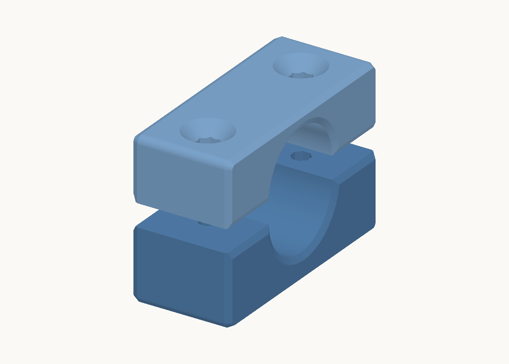
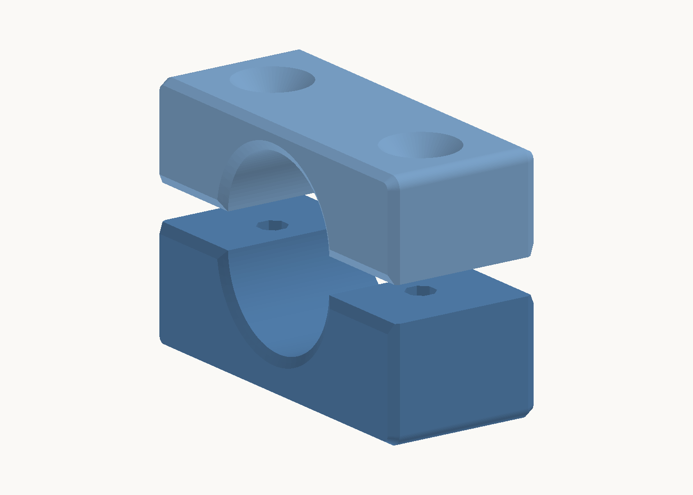

# THD heater holder — ABS clamp

A two-part clamp that holds the 220 V THD bath heater horizontally on the bath floor. The base is glued to the floor. The cap is pulled down onto the soft rubber head of the heater by two M4 screws. The clamp has no snap, so thermal swell of the head or the plastic does not matter.

**Experimental release:** [v0.1](https://github.com/sasha-nordiclab/thd-cp-lift-parts/releases/tag/heater-holder-v0.1). [Download the complete ZIP](https://github.com/sasha-nordiclab/thd-cp-lift-parts/releases/download/heater-holder-v0.1/heater-holder-v0.1.zip).

⬇️ **Download:** [Base](https://github.com/sasha-nordiclab/thd-cp-lift-parts/raw/main/heater-holder/step/THD_Heater_Holder_Base.step) · [Cap](https://github.com/sasha-nordiclab/thd-cp-lift-parts/raw/main/heater-holder/step/THD_Heater_Holder_Cap.step) · [FreeCAD model](https://github.com/sasha-nordiclab/thd-cp-lift-parts/raw/main/heater-holder/cad/THD_Heater_Holder.FCStd)

## Model

**Working model:** [THD_Heater_Holder.FCStd](cad/THD_Heater_Holder.FCStd), rebuilt from scratch with `python3 scripts/build.py` (fdmkit over RPC). All sizes are in the `params` spreadsheet.

- Body **Heater**: a reference mock-up. The rod is Ø16 × 110, the rubber head Ø20 × 20.
- Body **Base**: glued to the floor, with a half-round bed for the head.
- Body **Cap**: a plain block with a half-round bore, screwed onto the base.
- **Screw** is an M4 × 25 ISO 14581 (countersunk Torx) from the Fasteners workbench. **Screw_Mirror** is an `App::Link` to it.

### How the model is built

Both parts are symmetric about the vertical plane through the heater axis. Each one is modelled as its +Y half and mirrored once:

| Step | Base | Cap |
|---|---|---|
| 1. Half profile sketch | `s_b_half`: block with a corner round and the half bed | `s_k_half`: block with a corner round and the half bore |
| 2. Pad, symmetric, `c_len` | `b_half` | `k_half` |
| 3. Screw hole on +Y | `b_pilot`: octagonal pilot | `k_oct` and `k_hole`: octagon and countersink (PartDesign Hole) |
| 4. End-face chamfers | `b_bed_chamfer`, `b_top_chamfer` | `k_bed_chamfer`, `k_top_chamfer` |
| 5. Mirror the whole half across XZ | `b_mirror` | `k_mirror` |

The constraints in the half-profile sketches carry readable names, such as `axis_z`, `half_width`, `bore_r` and `cap_top`.

Every sketch is fully constrained, and every size comes from the `params` spreadsheet. Change a value there and recompute. Checked with a 24 mm head, a 25 mm head length, an 18 mm axis height and a 54 mm width.

### Coordinates

- z = 0 is the bath floor, which is also the base's glue face.
- The heater axis runs along X at `ax_z` = 15 mm.
- x = 0 is the joint between head and rod. The head is at x −20…0, the rod at x 0…110.

### Clamp

| | |
|---|---|
| Length along the axis | `c_len` = the full head length, 20 mm |
| Bore | Ø19.8 (`c_fit` 0.2 undersize), split at the axis with a `k_gap` 0.6 mm gap |
| Base | a solid block, 46 × 20 mm on the floor and 14.7 mm high, with a half-round bed |
| Cap | a plain block, 46 × 20 × 12.6 mm, with a half-round bore. Together with the base it makes one rectangular block split at the axis. The outer corners have an R1.5 round (`k_er`) |
| Screws | 2 × M4 × 25 ISO 14581, 304 stainless, at ±14.5 mm. The heads sit flush in 90° countersinks (Ø9.6) |
| Thread | the screws form their own thread in octagonal blind pilot holes in the base: 3.5 mm across flats, 13 mm deep. The screw bites into the flats, and the corners take the chips. Engagement is 11.8 mm |

Tightening the screws closes the gap, so the rubber head is squeezed by about 0.8 mm in height.

The heater bottom is 5 mm above the floor and the rod bottom 7 mm, so water flows under the rod.

## Files

- [cad/THD_Heater_Holder.FCStd](cad/THD_Heater_Holder.FCStd) is the parametric model.
- [`step/`](step/) holds the STEP files of the base and the cap.
- [scripts/build.py](scripts/build.py) rebuilds the model in a running FreeCAD through fdmkit.

## Print

ABS (AzureFilm ABS Plus), profile "0.20mm NordicLab 0.6 Ballance", 100 % zig-zag, Bambu A1:

| Part | Orientation | Time | Mass |
|---|---|---|---|
| Base | on its end face x = −20 (profile on the bed) | 36 min 0 s | 10.2 g |
| Cap | on its end face x = −20 (profile on the bed) | 32 min 30 s | 7.9 g |

ABS warps on the open A1. Both parts have a plain rectangular outline with rounded outer corners. Use a brim.

Every edge of both end faces has a chamfer: 1.2 mm along the print vertical at 30° from vertical, so 0.69 mm on the face (`e_h`, `e_a`). On the bed face it prevents elephant foot. The four outer corners of the block are rounded with R1.5 (`k_er`); they run along the print vertical.

All screw holes are octagons, with a flat facing up in the end-face print: a short bridge (< 2 mm) on top and 45° sides. The cap clearance holes are 4.5 mm across flats. The upper part of the 90° countersink is 45° from vertical, which is slightly over the 40° limit, but it is only about 2.5 mm deep.
